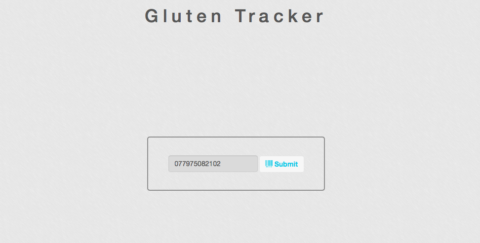
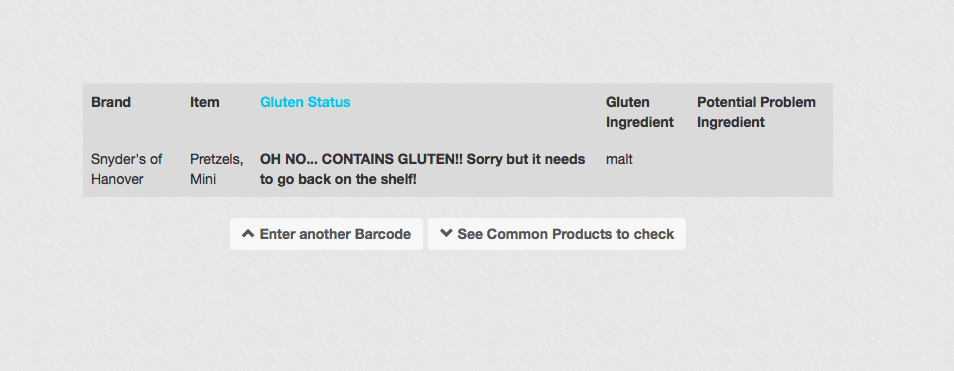
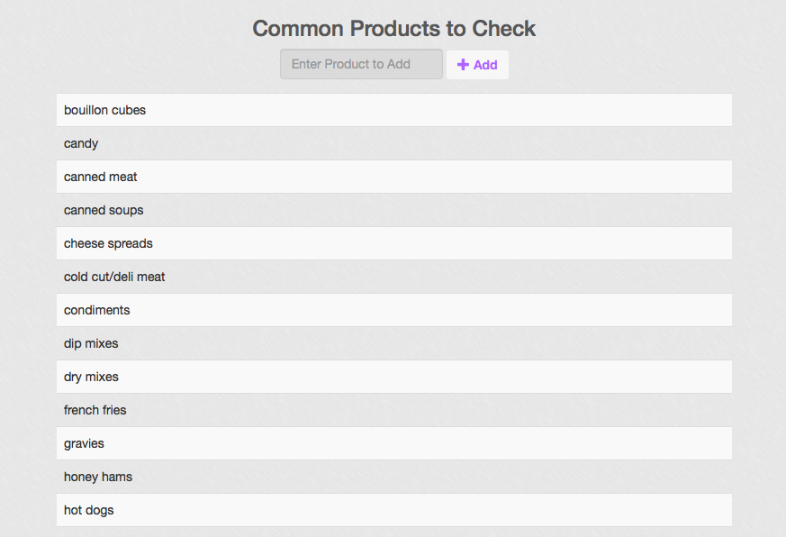

#Gluten Tracker Web App

##URL to live Project
[Check it out Here](http://kendrick-glutentracker-webapp.herokuapp.com/)  

###Overview of the project
Need to avoid gluten? This app allows you to enter a barcode and have a response if the item contains gluten or not. An api call is made to retrieve the ingredients and check them against the database of gluten containing ingredients. There is also a product section that contains common products to double check. There are capabilities to **Add** to the list for everyone to be aware! Need more information to use it? Check out the info page. The Ionic App is in a separate repo and the backend is utilized by both the app and the web application. [App Repo Here](https://github.com/dkendrick25/gluten_tracker_app)

##Technologies Used
* HTML
* CSS
* JavaScript
* Angular.js
* PostgreSQL
* Node.js

##Screen Shots

####Barcode

####Item Info

####Products

###Things to Add
* login feature with ability to choose allergy needs
* add to database of products and ingredients
